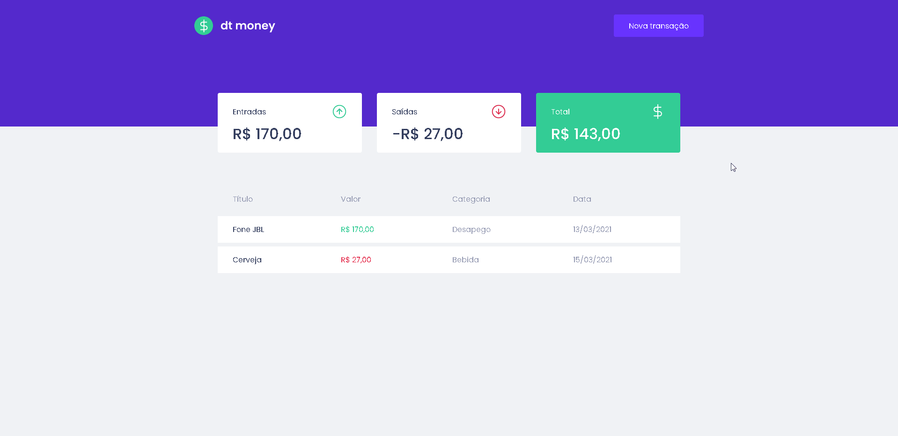

# 💰 dt money

O dt money é uma alternativa simples e eficaz para gerenciar suas finanças, permitindo o cadastro de entradas, saídas e a organização das mesmas em categorias.

---

## 💡 Preview

---

## 📌 Tecnologias

- React;
- Typescript;
- MirageJS;
- Axios;
- Styled-Components;

---

Feito com 💜 por [Camilla Correia](https://www.linkedin.com/in/camillacorreia)
